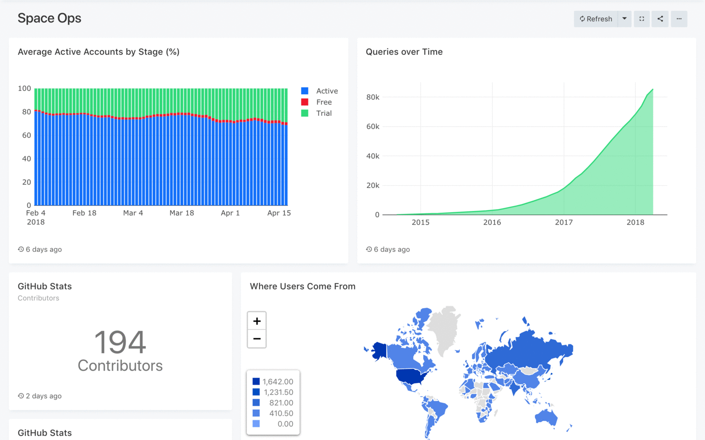

VIZ-My-Own-Data crafted to empower individuals, irrespective of their technical expertise, to tap into the potential of both large and small datasets. SQL users  can effortlessly delve visualize and disseminate data from various sources. Their efforts facilitate accessibility to data across their organization. Each day, countless users across numerous organizations globally rely to uncover insights and steer their decisions with data. Hoping to make the task a bit easier.

1. **Web-Based Experience**: Access everything directly through your web browser, with the convenience of shareable URLs.
2. **User-Friendly Interface**: Start working with data immediately, without the need for extensive software proficiency.
3. **Query Creation**: Swiftly craft SQL and NoSQL queries using intuitive tools like schema browsing and auto-complete.
4. **Visualizations and Dashboards**: Design captivating visual representations effortlessly through drag-and-drop functionality, and seamlessly integrate them into comprehensive dashboards.
5. **Collaboration Made Simple**: Foster teamwork by easily sharing visualizations and associated queries, facilitating peer review of reports and queries.
6. **Automated Data Refreshes**: Keep your charts and dashboards up-to-date automatically, according to intervals you define.
7. **Instant Alerts**: Set conditions to receive instant notifications when your data undergoes changes.
8. **RESTful API Access**: Access all functionalities available in the user interface through the REST API.
9. **Wide Range of Data Source Support**: Enjoy extensive data source compatibility through an adaptable API, with built-in support for numerous common databases and platforms.

## Supported Data Sources
Below is a list of built-in sources:

- Amazon Athena
- Amazon CloudWatch / Insights
- Amazon DynamoDB
- Amazon Redshift
- CSV
- Elasticsearch
- Microsoft Excel
- Google Analytics
- Google BigQuery
- Google Spreadsheets
- InfluxDB
- InfluxDBv2
- JSON
- MariaDB
- Microsoft Azure Data Warehouse / Synapse
- Microsoft Azure SQL Database
- Microsoft Azure Data Explorer / Kusto
- Microsoft SQL Server
- MongoDB
- MySQL
- Oracle
- PostgreSQL
- SQLite